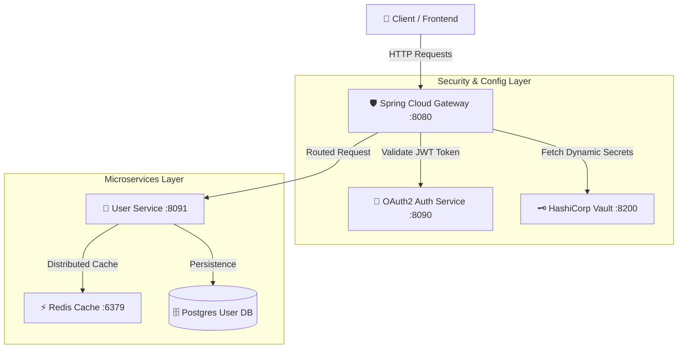

# 🛡️ CloudVault-Security
> **Spring Cloud Gateway, HashiCorp Vault, Distributed Redis Caching & OAuth2 / OpenID Connect Microservices Architecture**

---

## 📐 Enterprise Architecture

---

## 🗓️ 5-Day Development Roadmap

| Day | Module / Component | Technologies | Status |
| :--- | :--- | :--- | :---: |
| 📅 **Day 1** | `api-gateway` | Spring Cloud Gateway, Rate Limiting, Route Filters | 🔄 In Progress |
| 📅 **Day 2** | `auth-service` | OAuth2 / JWT Authorization Server, OIDC | ⏳ Queued |
| 📅 **Day 3** | `config-vault` | Spring Cloud Config & HashiCorp Vault Secret Management | ⏳ Queued |
| 📅 **Day 4** | `user-service` | User Management & Redis Distributed Caching Layer | ⏳ Queued |
| 📅 **Day 5** | `orchestration` | Docker Compose & Kubernetes Ingress Controller | ⏳ Queued |

---

## 👨‍💻 Author
**Ahmet Furkan Kısacık**  
* Software Engineer & Technical Instructor  
* Website: [ahmetfurkankisacik.com](https://ahmetfurkankisacik.com)  
* LinkedIn: [linkedin.com/in/afkdev](https://www.linkedin.com/in/afkdev)
